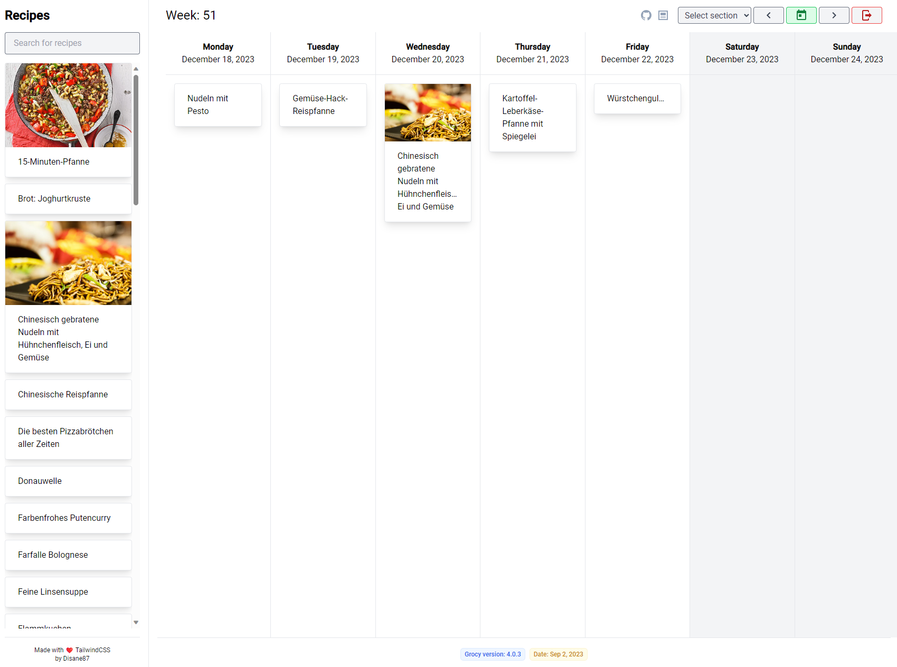
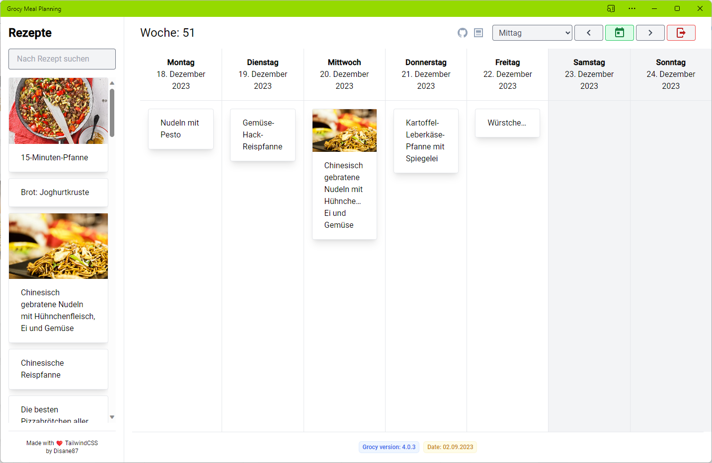

# Grocy meal planning 🥗

Comfortable meal planning for Grocy with pleasure.

## Why did I code this? 🤔

The UI for planning your week with meals feels pretty old fashioned in grocy. Therefore another UI has to be done where you can quickly plan your meals for the next week.

## Features

- 📅 Weekly planning
- 👋 Drag and drop: from recipe to planned meal
- 🎓 Assign sections to meals
- 🏠 Fully private. Your browser connects to your Grocy instance
- 📷 Duplicate planned meals holding `SHIFT` while dragging onto another day
- 🖼️ Beautiful UI
- 🌍 Localized for german and english

> [!IMPORTANT]  
> Currently the application is best viewd on minimum resolution of 1920x1080. > There are plans to make it mobile ready for smal devices.

## Screenshots 🖼️

## Using as a native app 🈸

In modern browsers you can install PWA apps on your machine and use them as they were native applications (with desktop icon and such). We support that and you can install that app according to the browser docs.

## Demo 👨‍💻

Just head to [https://grocy-meal-planning.disane.dev/](https://grocy-meal-planning.disane.dev/) fill in your grocy details `URL` and `API-Key` and you're good to go.

> [!IMPORTANT]  
> At this point, your grocy instance must be reachable from your device via HTTPs

> [!NOTE]  
> Your data stays private. This application is only runnign in your local browser and connects to your instance. Even if your grocy iinstance is not exposed to the internet, you can use this.

## Found issues? 🪲

Just file an issue. 👉
https://github.com/Disane87/grocy-meal-planning/issues
