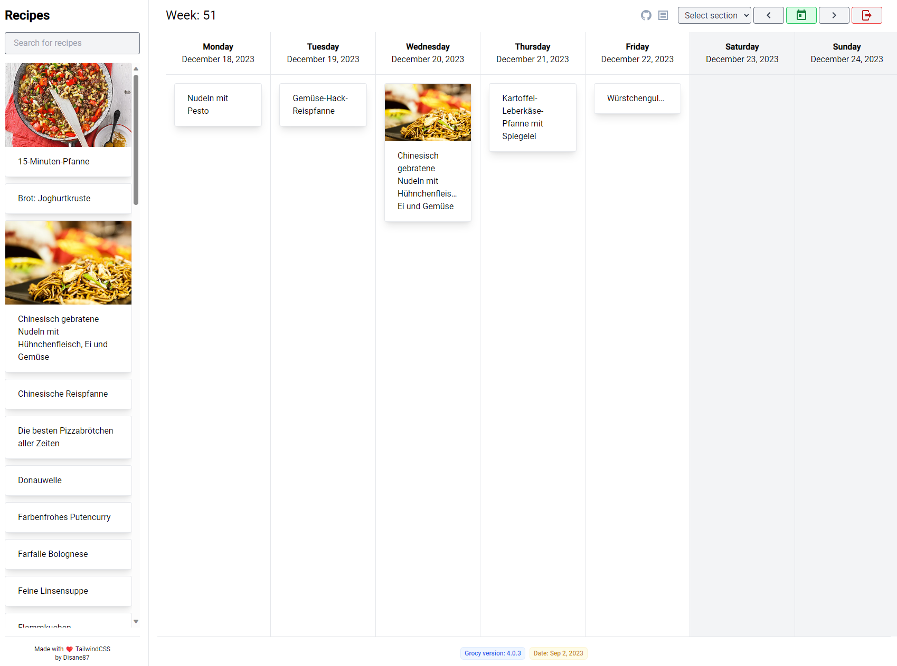
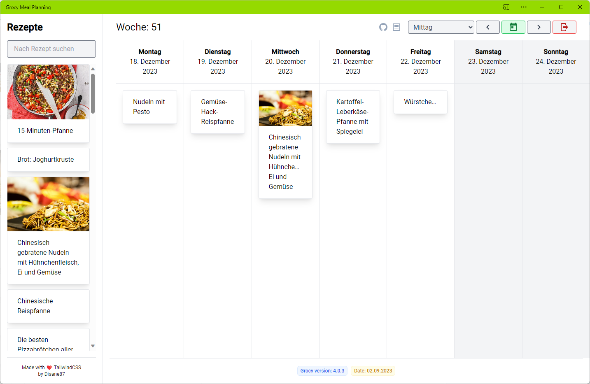

# Grocy meal planning 🥗

Comfortable meal planning for Grocy with pleasure.

## Why did I code this? 🤔

The UI for planning your week with meals feels pretty old fashioned in grocy. Therefore another UI has to be done where you can quickly plan your meals for the next week.

## Features

- 📅 Weekly planning
- 👋 Drag and drop: from recipe to planned meal
- 🎓 Assign sections to meals
- 🏠 Fully private. Your browser connects to your Grocy instance
- 📷 Duplicate planned meals holding `SHIFT` while dragging onto another day
- 🖼️ Beautiful UI
- 🌍 Localized for german and english

> [!IMPORTANT]  
> Currently the application is best viewd on minimum resolution of 1920x1080. > There are plans to make it mobile ready for smal devices.

## Screenshots 🖼️



## Using as a native app 🈸

In modern browsers you can install PWA apps on your machine and use them as they were native applications (with desktop icon and such). We support that and you can install that app according to the browser docs.



## Demo 👨‍💻

Just head to [https://grocy-meal-planning.disane.dev/](https://grocy-meal-planning.disane.dev/) fill in your grocy details `URL` and `API-Key` and you're good to go.

> [!IMPORTANT]  
> At this point, your grocy instance must be reachable from your device via HTTPs

> [!NOTE]  
> Your data stays private. This application is only runnign in your local browser and connects to your instance. Even if your grocy iinstance is not exposed to the internet, you can use this.

## Connecting to Grocy (CORS) 🔗

Grocy does **not** send `Access-Control-Allow-Origin` headers, so a browser blocks
direct requests from another origin with an error like:

```
Access to XMLHttpRequest at 'https://grocy.example.com/api/system/info' from origin
'https://grocy-meal-planning.example.com' has been blocked by CORS policy
```

You have two options:

### 1. Let the app proxy the requests (default)

If a direct request is blocked, the app automatically retries through its own API
server (`/api/grocy/**`) and remembers that decision. Nothing needs to be
configured — the Grocy URL and API key are forwarded per request and never stored
on the server. This requires the bundled Node server (Docker image / Coolify
deployment), not a static-only hosting.

Optional environment variables for the server:

| Variable | Default | Description |
| --- | --- | --- |
| `GROCY_PROXY_ALLOWED_HOSTS` | _(unset)_ | Comma separated hostname allowlist. When set, only those hosts may be proxied. |
| `GROCY_PROXY_ALLOW_PRIVATE` | `false` | Allow proxying to private/loopback addresses. Enable this when Grocy lives on the same private network as the server. |

Without an allowlist the proxy refuses targets that resolve to private, loopback
or link-local addresses so it cannot be abused to reach internal services.

### 2. Let Grocy allow this origin

If you'd rather keep requests going straight from the browser to Grocy, add the
CORS headers in the reverse proxy in front of Grocy, e.g. with nginx:

```nginx
add_header Access-Control-Allow-Origin "https://grocy-meal-planning.example.com" always;
add_header Access-Control-Allow-Headers "Content-Type, GROCY-API-KEY" always;
add_header Access-Control-Allow-Methods "GET, POST, PUT, DELETE, OPTIONS" always;

if ($request_method = OPTIONS) {
    return 204;
}
```

Then clear the `grocyUseProxy` entry in your browser's local storage (or reset the
config in the app) to go back to direct requests.

## Found issues? 🪲

Just file an issue. 👉
https://github.com/Disane87/grocy-meal-planning/issues
